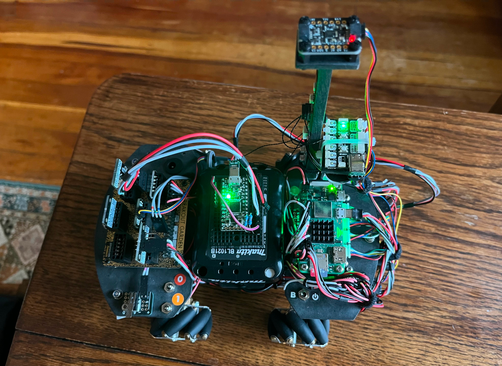

# RP2040 I2C Slave



This provides a simple implementation for using an RP2040-based MCU as an
I2C slave with a Raspberry Pi I2C master, sending a one-way message of up
to 32 ASCII characters to the slave from the master, returning a single
byte as status. There is currently no facility for returning longer messages,
though this is a future goal of this project.

The I2CSlave class in theory works with any RP2040 board. There are 
implementations here for three types of displays: a Neopixel, a WS2812 
RGB LED, or the Pico's single red LED.

The implementation uses Python (CPython) on the Raspberry Pi as the master
and MicroPython on the RP2040 as the slave. It communicates over default
I2C address `0x43`, though this is easily changed.

The I2C communications of this repository are largely based on and include
two significantly modified files from the original work by Morike Traore as
found at:

* [Raspberry-Pico---I2C-Slave](https://github.com/TraoreMorike/Raspberry-Pico---I2C-Slave)

This repository replaces an earlier code base, now labeled "legacy":

* [rp2040-i2c_slave-legacy](https://github.com/ifurusato/rp2040-i2c-slave-legacy/)


## Dependencies

There are no external dependencies apart from a recent version of MicroPython,
which can be downloaded from:

* [MicroPython downloads](https://micropython.org/download/)

This project is currently using CPython 3.11.2 and MicroPython v1.25.0.

A handy tool for working with MicroPython is rshell, available at:

* [rshell](https://github.com/dhylands/rshell)


## Installation/Deployment

Once you've installed a recent version of MicroPython on your RP2040 board,
the easiest way to deploy the code and test the project is using *rshell*.

(TL;DR: install the master.py and ./lib/ directory on your Raspberry Pi,
the contents of the ./upy/ directory on your RP2040.)

For discussion purposes, let's assume you've cloned the repository to the
following directory: `/home/pi/workspace/rp2040-i2c-slave/upy`

If your RP2040 board is showing up at `/dev/ttyACM1` you'd start an rshell
session with:
```
  % rshell -p /dev/ttyACM1
  /home/pi/workspace/rp2040-i2c-slave/upy>
```
then change the working directory to the board itself:
```
  % cd /pyboard
  /pyboard>
```
Then you can copy the files to the board in one go using the `rsync` command,
where the `.` indicates the current working directory, e.g.,
```
  /pyboard> rsync /home/pi/workspace/rp2040-i2c-slave/upy .
  Adding /pyboard/neopixel.py
  Adding /pyboard/RP2040_I2C_Registers.py
  [...]
```
You can either `exit` rshell and push the board's RST button to execute the
main.py script, or enter the Python REPL and `import main` (when importing
you don't include the file extension) to execute its code:
```
  /pyboard> repl
  MicroPython v1.25.0 on 2025-04-15; Adafruit ItsyBitsy RP2040 with RP2040
  Type "help()" for more information.
  >>>
  >>> import main
```
This will start I2C slave mode on the RP2040. If you're using an ItsyBitsy
RP2040 you should see its NeoPixel flash a cyan blue three times.

You can then go back to the Pi and execute master.py with a payload argument.


## Files

There are only a few files that you need pay attention to:

On the Raspberry Pi:

* master.py           : the I2C master as a CLI app

On the RP2040:

* upy/main.py         : the I2C slave application entry point
* upy/controller.py   : a generic payload processor

You may want to modify main.py to integrate with your own code or
application.

You will want to modify the Controller to process your payload content
and perform any specific functions.

You won't likely need to modify any of the other files unless you want
to extend some existing functionality. 

See FILES for the complete list of files.


## Hardware Installation

The ItsyBitsy RP2040 uses pin GPIO2 for SDA and pin GPIO3 for SCL on bus 1.
You should also be sure to connect the GND pin to the common ground of your
Raspberry Pi. If you're connecting it to your Pi via a USB connector you
won't need to provide 3.3V to the board as that will be provided via USB.

The RP2040 requires 10K pullup resistors on SDA and SCL to operate correctly. 


## Testing

You can then test to see if things are working by executing the `master.py`
file with a string argument:
```
 % master.py "This is something important."
  creating connection to I2C bus on address 0x44…
  writing I2C payload of 28 chars: 'This is something important.'…
  writing completion code…
  write complete.
```
Note that this only supports ASCII strings of up to 32 characters between
SPACE and `~`. The response will be something like:
```
  read data: '32'
  response: okay
  complete.
```
If you're using an ItsyBitsy RP2040 the NeoPixel should flash green if the
transmission was successful.


## Usage

As described above, copy the contents of the `./upy/` directory to an RP2040
that has a recent version of MicroPython installed. The "main.py" file is
used for the ItsyBitsy RP2040 and includes use of its NeoPixel. If you're
using a different RP2040 board you can use the "main_no_px.py" file instead,
as that has no NeoPixel support and therefore should be pretty generic. If
you want to use the latter you'd need to rename it to "main.py".

On the Raspberry Pi side, the provided "master.py" file expects a command
line argument, which must be composed of a maximum of 32 ASCII characters
between SPACE (32) and "~" (126). For example,
```
  % master.py "Send this message."
```

The I2C slave will receive the message and respond with a single byte status
indicator. The hardcoded values can be found in the MicroPython response.py.

## Next Steps

The next phase of this project will be to further simplify the code, which
is still rather baroque.


## Support & Liability

This project comes with no promise of support or liability. Use at your own risk.


## Copyright & License

This software is Copyright 2025 by Murray Altheim, All Rights Reserved.

Distributed under the MIT License, see LICENSE file included with project.


