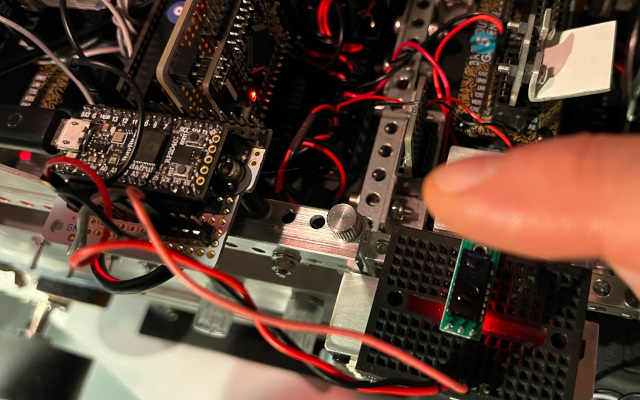

# RP2040 I2C Slave


This provides a simple implementation for using an RP2040-based MCU as an
I2C slave with a Raspberry Pi I2C master, sending a one-way message of up
to 32 ASCII characters to the slave from the master, returning a single
byte as status. There is currently no facility for returning longer messages,
though anyone wishing to contribute code to provide that feature is most
welcome to do so.

The I2CSlave class works with any RP2040. There is also an I2CDriver class
that wraps the core functionality, targeted for use with the Adafruit
ItsyBitsy RP2040 with its NeoPixel as a status indicator. This leaves the
test files as only a few lines long. An I2CPicoDriver is available for use
with the Raspberry Pi Pico RP2040, blinking its LED as a status indicator.

The implementation uses Python (CPython) on the Raspberry Pi and MicroPython
on the RP2040. It communicates over I2C address `0x44`, though this is easily
changed.

The I2C communications of this repository are largely based on (and include
two files from) the original work by TraoreMorike as found at:

* [Raspberry-Pico---I2C-Slave](https://github.com/TraoreMorike/Raspberry-Pico---I2C-Slave)

See FILES for a list of included files and their respective uses.


## Dependencies

There are no external dependencies apart from a recent version of MicroPython,
which can be downloaded from:

* [MicroPython downloads](https://micropython.org/download/)

This project is currently using MicroPython v1.23.0.

A handy tool for working with MicroPython is rshell, available at:

* [rshell](https://github.com/dhylands/rshell)


## Installation/Deployment

Once you've installed a recent version of MicroPython on your RP2040 board,
the easiest way to deploy the code and test the project is using *rshell*.

For discussion purposes, let's assume you've cloned the repository to the
following directory: `/home/pi/workspace/rp2040-i2c-slave/`, with its
MicroPython files in the `/upy/` subdirectory.

If your RP2040 board is showing up at `/dev/ttyACM1` you'd start an rshell
session with:
```
  % rshell -p /dev/ttyACM1
  /home/pi/workspace/rp2040-i2c-slave/upy>
```
then change the working directory to the board itself:
```
  % cd /pyboard
  /pyboard>
```
Then you can copy the files to the board in one go using the `rsync` command,
where the `.` indicates the current working directory:
```
  /pyboard> rsync /home/pi/workspace/rp2040-i2c-slave/upy .
  Adding /pyboard/neopixel.py
  Adding /pyboard/RP2040_I2C_Registers.py
  Adding /pyboard/stringbuilder.py
  [...]
```
Then you can either `exit` rshell and push the board's RST button to execute
the main.py script, or enter the Python REPL and `import main` (you don't
include the file extension) to execute its code:
```
  /pyboard> repl
  MicroPython v1.23.0 on 2024-06-02; Adafruit ItsyBitsy RP2040 with RP2040
  Type "help()" for more information.
  >>>
  >>> import main
```
This will start I2C slave mode on the RP2040. If you're using an ItsyBitsy
RP2040 you should see its NeoPixel flash a bright cyan blue three times,
and then a dimmer continuous flash after that.


## Hardware Installation

The ItsyBitsy RP2040 uses pin 24 for SDA and pin 25 for SCL. You should also
be sure to connect the GND pin to the common ground of your Raspberry Pi. If
you're connecting it to your Pi via a USB connector you won't need to provide
3.3V to the board as that will be provided via USB. So: just three wires, as
per the photo.


## Testing

You can then test to see if things are working by executing the `master.py`
file with a string argument:
```
 % master.py "This is something important."
  creating connection to I2C bus on address 0x44…
  writing I2C payload of 28 chars: 'This is something important.'…
  writing completion code…
  write complete.
```
Note that this only supports ASCII strings of up to 32 characters between
SPACE and `~`. The response will be something like:
```
  read data: '32'
  response: okay
  complete.
```
If you're using an ItsyBitsy RP2040 the NeoPixel should flash green if the
transmission was successful.


## Usage

As described above, copy the contents of the `./upy/` directory to an RP2040
that has a recent version of MicroPython installed. The "main.py" file is
used for the ItsyBitsy RP2040 and includes use of its NeoPixel. If you're
using a different RP2040 board you can use the "main_no_px.py" file instead,
as that has no NeoPixel support and therefore should be pretty generic. If
you want to use the latter you'd need to rename it to "main.py".

On the Raspberry Pi side, the provided "master.py" file expects a command
line argument, which must be composed of a maximum of 32 ASCII characters
between SPACE (32) and "~" (126). For example,
```
  % master.py "Send this message."
```

The I2C slave will receive the message and respond with a single byte status
indicator. The hardcoded values can be found in the MicroPython slave file:
```
INIT              = 0x10
OKAY              = 0x20
BAD_ADDRESS       = 0x41
OUT_OF_SYNC       = 0x42
INVALID_CHAR      = 0x43
SOURCE_TOO_LARGE  = 0x44
UNVALIDATED       = 0x45
EMPTY_PAYLOAD     = 0x46
PAYLOAD_TOO_LARGE = 0x47
UNKNOWN_ERROR     = 0x48
```
On the Raspbery Pi side there is a Response Enum capable of matching these
values:
```
  _read_data = _i2cbus.read_byte_data(I2C_SLAVE_ADDRESS, CONFIG_REGISTER)
  _response = Response.from_value(_read_data)
```

## Extending the I2CSlave or I2CDriver class

This is an example of how to use this project to provide an I2C slave
functionality for your own purposes.

The I2CSlave class can be extended by your own class when you require
the ability to respond to requests from an I2C master. An example of
this is provided by the Sensor class, in `sensor.py` and its test script,
`sensor_test.py`.



The hardware part of this example uses a Pololu Digital Distance Sensor
(GP2Y0D810Z0F), a small green carrier board for a Sharp IR sensor, with
a range of 10cm. The sensor has a single output pin that returns a high
or low value as an output when it detects an obstacle within range. The
sensor can be seen mounted on the breadboard at lower right, its red LED
lit to indicate it detects the finger.

The output from the sensor is connected with a pink wire to the Itsy Bitsy
RP2040's GPIO pin 18, as seen at left. You don't have to use a pink wire.

The software part of this example uses a Sensor class, which extends the
I2CDriver class and overrides its output to return one of two newly-defined
byte response codes, "OFF" (`0x30`) or "ON" (`0x31`) if the response from
the I2CSlave is "OKAY" (`0x4F`); error codes are passed back to the master
directly.

The response.py file has been modified to accommodate the two new enumerated
values as `VALUE_ON` and `VALUE_OFF`, so that entering "import sensor_test"
from the Python REPL will return 'on' or 'off' depending on whether the IR
sensor detects an obstacle within range.


## Next Steps

The slave side code has been converted to two classes, I2CSlave to provide
the core functionality, and I2CDriver which extends the base class by
providing support for NeoPixel visual feedback.

The next phase of this project will be to convert the `master.py` on the
Pi to a Python class, so that it can be more easily extended and used as
a base class.


## Support & Liability

This project comes with no promise of support or liability. Use at your own risk.


## Copyright & License

This software is Copyright 2024 by Murray Altheim, All Rights Reserved.

Distributed under the MIT License, see LICENSE file included with project.

